# RME40003 ROBOT SYSTEM DESIGN

## Automated Assembly Project (Wireless Mouse)

**Abdulswamad Rama Salim (101229220)**

**Logarajan Muthu (4302281)**

**Mohd Afif Jazimin Bin Mohamad Norzaidin (102763305)**

**Lecturer: Dr. Hudyjaya Siswoyo Jo**

---

## Table of Contents

- [Introduction](#introduction)
- [Objectives](#objectives)
- [Gantt Chart & Job distribution](#gantt-chart--job-distribution)
- [Product study](#product-study)
- [Product Design](#product-design)
- [Redesign of Product](#redesign-of-product)
- [Fixtures & Feeders](#fixtures--feeders)
- [Finalized Feeders](#finalized-feeders)
- [Feeders 1- Base shell](#feeders-1--base-shell)
- [Feeders 2- Sensor](#feeders-2--sensor)
- [Feeders 3 - Mouse Wheel](#feeders-3--mouse-wheel)
- [Feeders 4 Mid Mouse](#feeders-4-mid-mouse)
- [Feeders 5 USB](#feeders-5-usb)
- [Feeders 6 Top Shell](#feeders-6-top-shell)
- [Palette](#palette)
- [Gripper choice](#gripper-choice)
- [Finger design](#finger-design)
- [Vacuum Gripper design](#vacuum-gripper-design)
- [Vacuum Gripper Mount](#vacuum-gripper-mount)
- [End of Arm Tooling Adapter Design](#end-of-arm-tooling-adapter-design)
- [Finalized Grippers Design](#finalized-grippers-design)
- [Mouse Base Shell](#mouse-base-shell)
- [USB Bluetooth Dongle](#usb-bluetooth-dongle)
- [PCB and Mouse Top Shell](#pcb-and-mouse-top-shell)
- [Complete Mouse](#complete-mouse)
- [Robot selection](#robot-selection)
- [Finalized Robot](#finalized-robot)
- [Design of Robotic Cell layout](#design-of-robotic-cell-layout)
- [Safety system design](#safety-system-design)
- [Cycle time Analysis](#cycle-time-analysis)
- [Economic Justification](#economic-justification)
- [Conclusion](#conclusion)
- [Appendix/References](#appendixreferences)

---

## Introduction

In today's competitive landscape, businesses seek innovative solutions to boost productivity and minimize errors. The project aims to build an Automated Assembly System for a specific product. By transitioning from manual labor to automation, several benefits can be realized.

These benefits include enhanced efficiency where automation streamlines the assembly process for faster production at a reduced time, labor costs are reduced as human operators are less necessary, consistent in production quality as uniformity in product assembly is applied, the production capacity is increased, flexibility in adjusting production levels based on market demand, and long-term profitability is sustained as efficiency and quality are prioritized.

Embracing automation in assembly processes can revolutionize production, optimize resource utilization, and the position of the company for long-term success.

## Objectives

For the project goal to be delivered successfully, important objectives were set to ease the project management and the project planning was also implemented to ensure that the tasks can be completed in the given timeframe.

- To design an automated assembly system
- To redesign the selected product for easy assembly
- To construct feeder track
- To select the suitable robotic arm for the proposed project
- To design an efficient and safe robotic cell layout
- To improve the production rate by minimizing the time taken for product assembly
- To justify the investment for automation

---

## Gantt Chart & Job distribution

**Figure 1: Gantt Chart Project Plan**

The job distribution made by our team is as follows:

| Loga | Rama | Afif |
| :--- | :--- | :--- |
| 3D modelling of the wireless component in SolidWorks | | Manual assembly and timing record |
| Design feeders and fixtures | Design grippers | Redesign components |
| Design robot cell layout | Select robot arm | Design safety cell system |
| | Cycle time analysis | |
| | Economic justification | |
| | Documentation | |
| | Presentation | |

---

## Product study

### Product Design

In this project, a case study involving a wireless mouse was chosen to be redesigned to make it more suitable for a robot to operate the automated assembly process. The components of the wireless mouse are as shown:

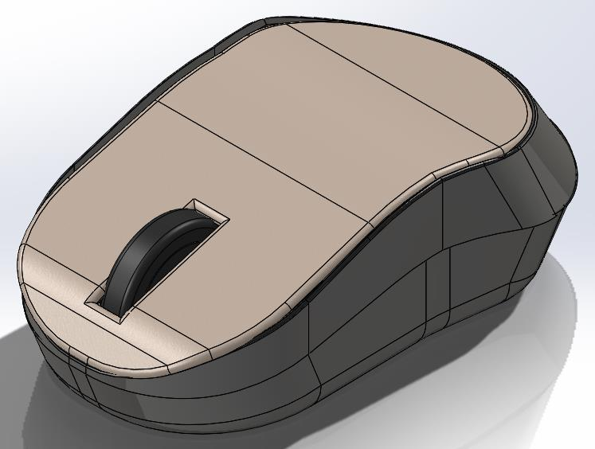

**Figure 2: Wireless Mouse Disassembly**

| Component | Quantity |
| :--- | :--- |
| Base Shell | 1 |
| Middle Shell | 1 |
| Top Shell | 1 |
| PCB (Assembled) | 1 |
| Sensor Lens | 1 |
| Connect Button | 1 |
| 2.4GHz Connector | 1 |
| Scroll Wheel | 1 |
| Screw | 2 |

The total parts currently in the wireless mouse is 10.

The wireless was then modeled in SolidWorks to obtain all the necessary information and as preparation for the redesigning process.

**Figure 3: Wireless Mouse 3D Model**

The details of the assembly components can be seen by observing the exploded view of the 3D model of the original mouse design in SolidWorks.

**Figure 4: Original Mouse Design Exploded View**

---

## Redesign of Product

The redesigning of the product aims for ease of assembly for the robot with efficiency and minimal time requirement as a priority. The comparison for parts of the original design and the new design can be seen in Table:

**Table 1: Original and New Design Components**

| Original Design | New Design |
| :--- | :--- |
| Base Shell | Base Shell |
| Middle Shell | Middle Shell |
| Top Shell | Top Shell |
| PCB (Assembled) | PCB (Assembled) |
| Scroll Wheel | Scroll Wheel |
| Sensor Lens | Sensor Lens |
| Connect Button | Tactile Switch |
| 2.4GHz Connector | 2.4GHz Connector |
| PCB Screw | Screwless PCB Standoff |
| Shell Screw | Clipper |

**Table 2: Number of Parts from Original and New Design**

| | Original Design | New Design |
| :--- | :--- | :--- |
| No. of Parts | 10 | 7 |

The table shows which components or parts are being redesigned to ease the mouse assembly. The table cells with the same colour fill indicate that it is no longer two separate parts. As for the scroll wheel, it underwent a redesign of its own without affecting the number of parts or components in the wireless mouse.

The diagrams below show specific components or parts in what was changed from the original mouse design. The format of the diagrams follows as original design and new design respectively.

**Base Shell**

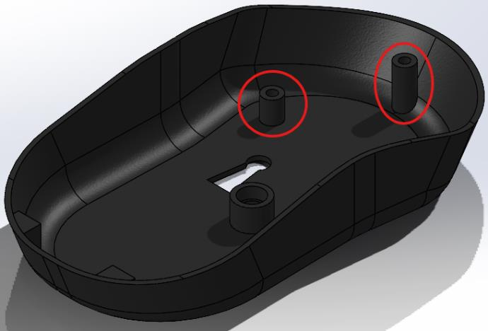

**Figure 5: Base Shell Design Comparison**

The screw hole, on the left-hand side, was replace with a screwless PCB standoff that just clips on and holds the PCB in place. On the right-hand side, the shell screw was replaced by a simple clipper to connect the base shell and the middle shell together. The same changes were made to the middle shell as well to accommodate the new clipper design.

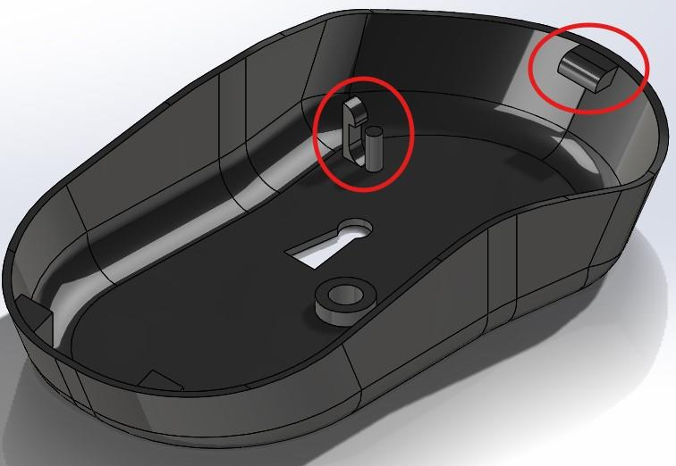

**Figure 6: Middle Shell Design Comparison**

Due to this assembly method redesigned, screws were no longer needed, and this part of the process has eliminated 2 components from the original mouse design.

**Connect Button**

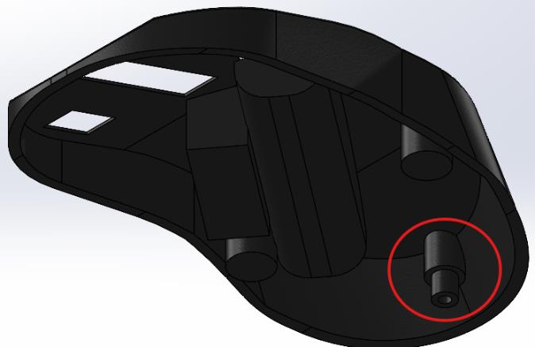

**Figure 7: Connect Button Design Comparison**

Initially, the connect button for the wireless mouse used a separate rubber button that touches a physical pad on the underside of the PCB. To avoid having additional small components, the redesigned button was to solder a 6.0x6.0x7.0mm tactile switch directly on to the underside of the PCB.

The base shell had also been redesigned to accommodate the new connect button. The standoff was shortened from 5.0mm to 2.0mm.

**Figure 8: Connect Button New Standoff**

In this process, the tactile switch is considered to be a part the PCB assembly and this eliminated 1 component from the original mouse design.

**Scroll Wheel**

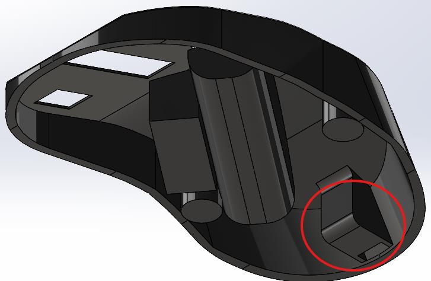

**Figure 9: Scroll Wheel Design Comparison**

The left-hand side of the mouse in the PCB assembly was changed from a cylinder to a hexagonal prism to match its right-hand side counterpart. This part is used to enable the function of scroll clicking by coming in contact with a tactile switch on the PCB.

In this redesigning process, it does not affect the number of components, but it does provide ease during the feeding process. This is due to having identical sides and the feeder does not need to identify the prism side apart from the cylinder side.

The whole view of the redesigned mouse can be observed from the exploded view of the 3D model in SolidWorks.

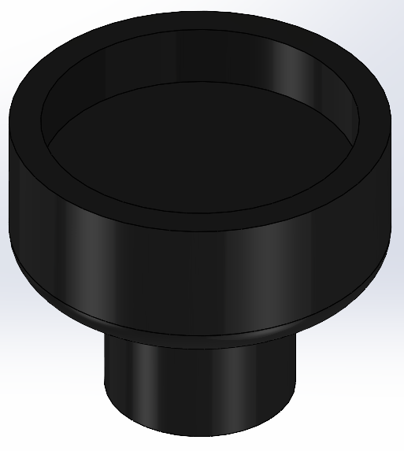

**Figure 10: Redesigned Mouse Exploded View**

---

## Fixtures & Feeders

In this project, to design the automated assembly system for mouse assembly, it was necessary to be able to supply the mouse parts to the robot work station and the mouse parts need to be sorted so that it is supplied in a desired orientation. Bowl feeders are used to supply the parts as it is cost effective to replace manual labor. The mouse consists of 7 component parts where 6 of the component parts will be supplied using bowl feeders and PCB component will be supplied using palette feeders.

The fixture was designed to ease the assembly of the mouse as the assembly is done from the bottom to top parts for the convenience of assembly production that will be done using robotic arm.

**Table 3**

| Assembly | Component | Device | Model |
| :--- | :--- | :--- | :--- |
| 1 | Mouse base | Bowl feeder | K-B40LCB54 |
| 2 | Sensor | Bowl feeder | K-B25LCB33 |
| 4 | Mouse wheel | Bowl feeder | K-B25LCB33 |
| 5 | Mid-section Mouse | Bowl feeder | K-B40LCB54 |
| 6 | USB Dongle | Bowl Feeder | K-B25LCB33 |
| 7 | Top-section Mouse | Bowl Feeder | K-B40LCB54 |

---

## Finalized Feeders

The fixture was designed using the dimension (80mmx50mm) as it used as the base for the mouse assembly. The fixture was designed with cuts at the side to allow the gripper fingers to be able to pick and place the mouse on the fixtures. The image below shows the mold design for the fixture design.

The image of the base mouse placed on the fixture is attached below as Figure 2 to show actual fit of the component during the assembly process being. The fixture's design is made to keep the mouse in a rigid position and ensure that during the assembly process the robot can place the components at the desired position to avoid any wrongly assembled product.

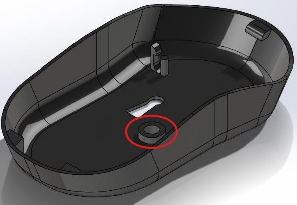

**Figure 15: Mouse Fixture**

**Figure 16: Base shell**

### Feeders 1- Base shell

The figure below the show the track used to differentiate the orientation of the part when supplied to the assembly area. The feeder track is designed with a height deflector as to remove the part when it is upside down, the base part has irregular shape that will cause it to have a lengthy height compared to when the base part on its flat surface which will cause it to fall. The it is deflected to a narrow path to sort the parts and to remove it when in undesired orientation. The finally the base shell pass through an irregular cutout to sort it to the desired orientation as shown in Figure 19.

**Figure 17: Feeder Track - Base shell**

**Figure 18: Feeder Track with**

**Desired Orientation:**

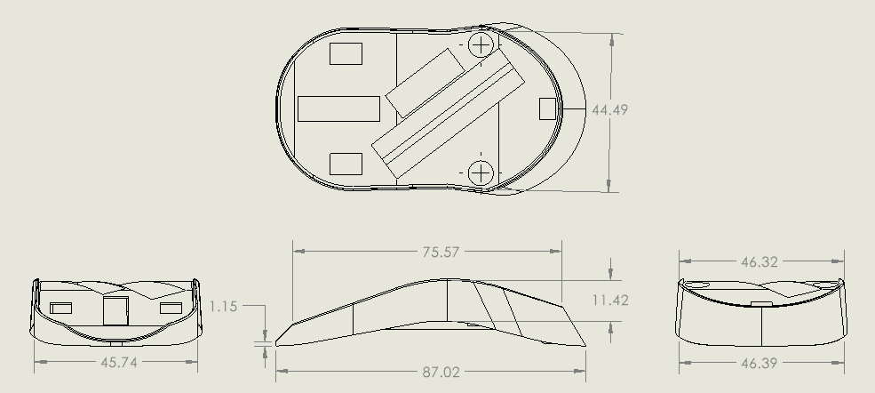

**Figure 19: Orientation for Base shell**

**Height Deflector:**

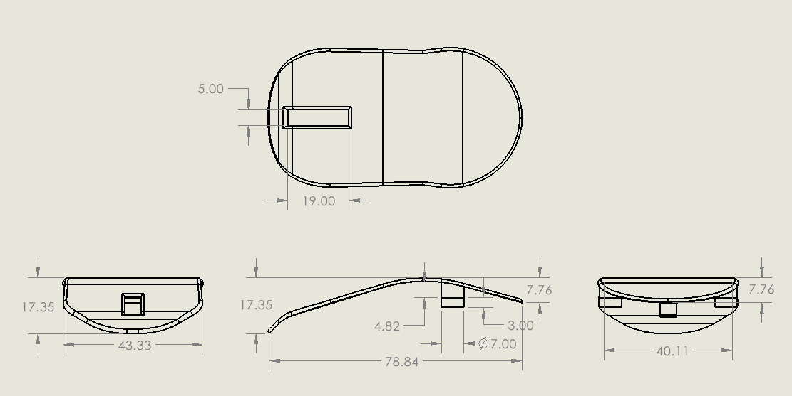

**Figure 20: Height Deflector**

**Figure 21: Orienteer**

**Figure 22: Final Orientation**

### Feeders 2- Sensor

The track for the sensor feeder was designed to ensure that the component will be supplied at desired orientation as shown below.

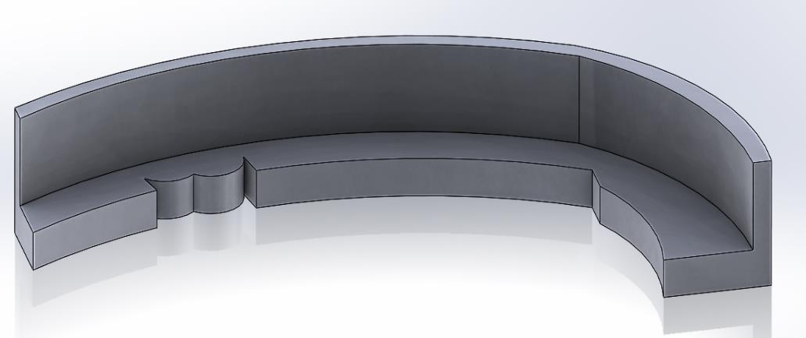

**Figure 23: Final Orientation**

These are possible orientation that the part could be possible supplied and the Figure 24 shows the view of the how the deflectors and orienteers are used to determine the final position that is supplied to the assembly work station.

**Figure 24: Feeder Track for Sensor Lens**

**Height Deflector:**

**Figure 25: Height Deflector**

**Figure 26: Height Deflector**

Using the height deflectors, the sensor lens can be sorted to the narrow path to ensure the component is supplied in an orientation that is suitable for the assembly as shown in Figure 26 and the final orientation which is sorted using a narrow path to remove the component when it on the flat side on the part.

**Figure 27: Final Orientation**

### Feeders 3 – Mouse Wheel

The feeder track for the mouse wheel is designed to ensure that the mouse wheel can be easily picked by the grippers horizontally. For the mouse scroll wheel the part was redesigned to ensure the component has symmetrical design so that the component will be the same from the from view position.

The initial deflector will cause the part to fall when wheel is facing towards the track and then the next deflector will cause the part to rotate or to be rejected when it falls from the track as shown in figure below.

Finally, the scroll wheel will fall into the track to sorted into the right orientation.

**Figure 28: Feeder Track**

**Figure 29: Scroll Wheel**

### Feeders 4 Mid Mouse

The track for the middle shell was made was designed to ensure the component was supplied in the right orientation and the deflectors were used to deflect to follow the desired orientation. The figure below shows the track used for the feeder to supply the part.

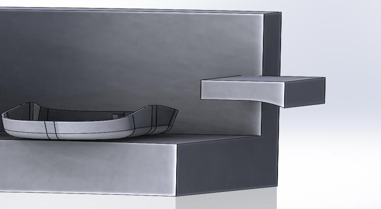

**Figure 30: Feeder track design**

The figure below shows the possible orientation that is could be supplied. The final orientation when the middle shell of the mouse is supplied to the assembly area is as shown in figure 31.

**Figure 31: Middle Shell**

### Feeders 5 USB

The image below shows the track used in the feeder for USB Dongle and the deflector used to remove the component when the orientation does not follow the track path. The USB component is needed to be the vertical position so that the grippers can pick the component from the horizontal sides of the part. This was done to ensure the gripper has to only open for a minimum distance to pick the part.

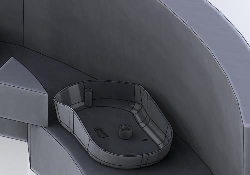

**Figure 32: Feeder Track**

The orientation of USB Dongle is shown in the figure below. The desired orientation is also attached in the figure below to show the final orientation of the component.

**Figure 33: USB Dongle**

By using the height deflector, the component is removed when it is in a vertical position due to the height difference and using a narrow path, it is sorted in 2 possible orientation and finally using a cutout on the narrow track in Figure 34, the USB Dongle part is sorted to suit the orientation that is suitable for the assembly process.

**Figure 34: USB Dongle Final Orientation**

### Feeders 6 Top Shell

The track for the top shell was made was designed to ensure the component was supplied in the right orientation and the deflectors were used to divert to follow the desired orientation. The figure below shows the track used for the feeder to supply the part.

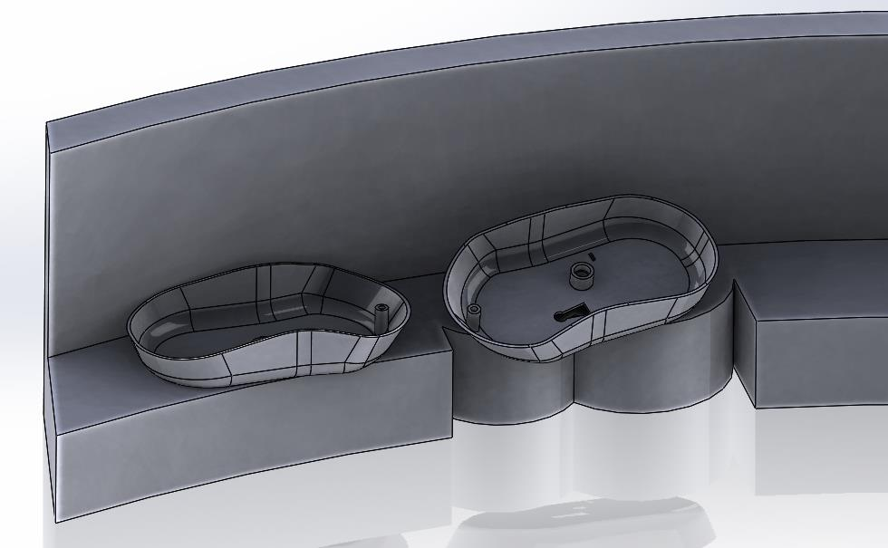

**Figure 34: Feeder track design**

The figure below shows the possible orientation that is could be supplied. The final orientation when the top shell of the mouse is supplied to the assembly area is as shown in figure 35. The track design is similar the track designed used for the other parts of mouse shell except the height deflector used has a cutout to allow only the top shell in the right position as shown in the Figure 35.

**Figure 35: Top Shell**

### Palette

The palette feeder is used to supply the PCB component to the assembly area. The fixture used to supply the PCB component is shown in the figure below. The tray designed to contain a total of 25 components of PCB at a single feed of tray.

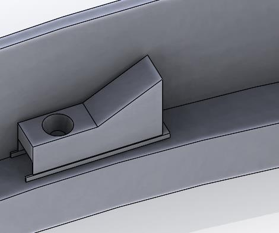

**Figure 36: Palette Fixture**

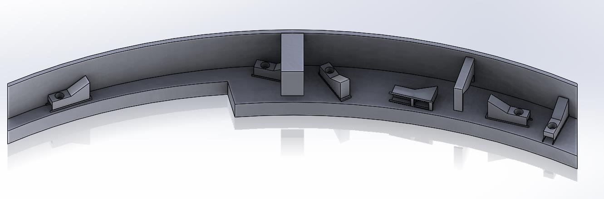

**Figure 37: PCB Feeder**

---

## Gripper choice

In the context of our Automated Assembly Project, the selection of an appropriate gripper is crucial for the precise handling and assembly of the wireless mouse components. Since most of our parts are boxy with flat sides, a two-finger parallel gripper was identified as the most suitable. The smallest component, the USB Bluetooth dongle, requires a minimal stroke of 7mm for effective gripping.

However, the difference between our largest part and smallest part was way more than 7 mm, so this stroke couldn't be used in determining our gripper. Given the largest stroke for our largest part (complete mouse) was 44 mm, we selected the Destaco's RPW 375M-2 which offers a total stroke of 50.8 mm. RPW 375M-2 is a pneumatic parallel gripper with a gripping force of up to 400N, ensuring secure handling of the lightweight 79 g wireless mouse.

**Figure 38: RPW 375M-2 Parallel Pneumatic Gripper**

The parallel design of the gripper ensures long finger grip designs, essential for our varied part sizes. The rack and pinion mechanism within the gripper deliver smooth and precise operations, while its rugged construction promises durability and long operational life. Weighing only 0.91 kg, the RPW 375M-2 is an optimal match for our robot (EC63), which has a payload capacity of 3 kg.

Below are further specifications of the gripper from the datasheet.

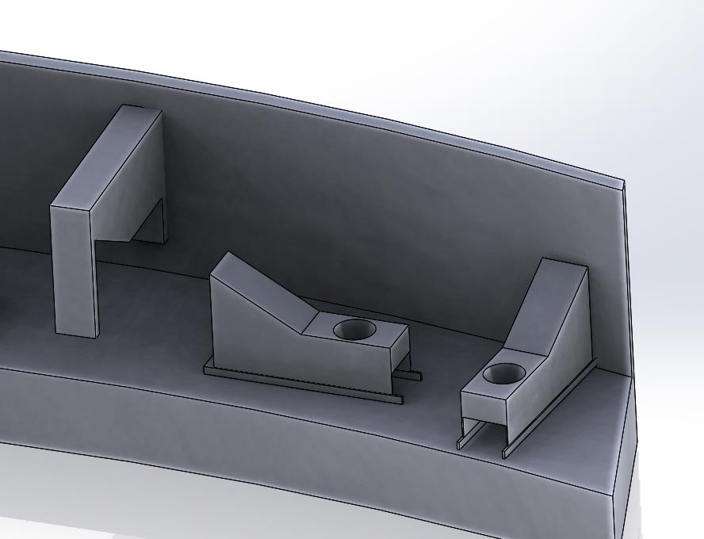

**Figure 39: Gripper Actuator (RPW 375M-2 Specifications)**

### Finger design

The fingers are crafted from Aluminum 6061, known for its strength and lightweight properties, essential for precise and agile manipulation. Each finger is attached to the finger mounts using an M5 Allen Bolt, thus easy replacement or adjustment tailored to specific project requirements. The gripper mount is attached to the gripper actuator using a combination of M6, M5, and M4 Allen Bolts. The gripper mount together with the finger attached to the gripper actuator can be seen in the pictures below.

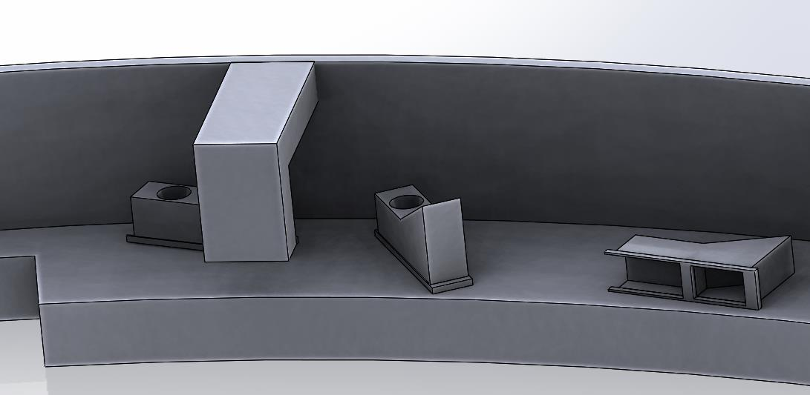

**Figure 40: Finger gripper design.**

**Figure 41: Finger gripper screwed on the mounts to Gripper Actuator**

### Vacuum Gripper design

The printed circuit board and the top shell parts of the wireless mouse are very delicate and thin hence we could not use our fingers to grip them. This is so as to avoid damaging the parts and to allow for smooth assembly. A vacuum gripper was chosen instead to grab these two parts . The FSTE M5-IG 20 Spring Plunger from Schmalz was chosen as the Mounting element for the vacuum gripper. This is due to its lightweight being only 25g and (justify based on the technical data below)

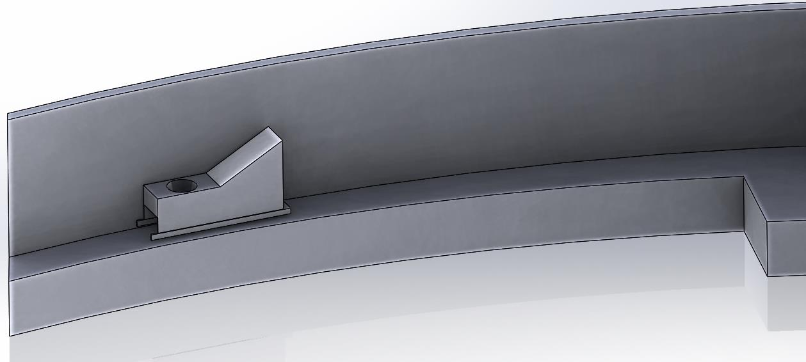

**Figure 42: Mounting Element from Schmalz and its Specifications.**

The vacuum cup chosen is Destaco's VC-B05 which is only 5mm in diameter with a Holding capacity of .04 kg and its only 5.8g hence very lightweight.

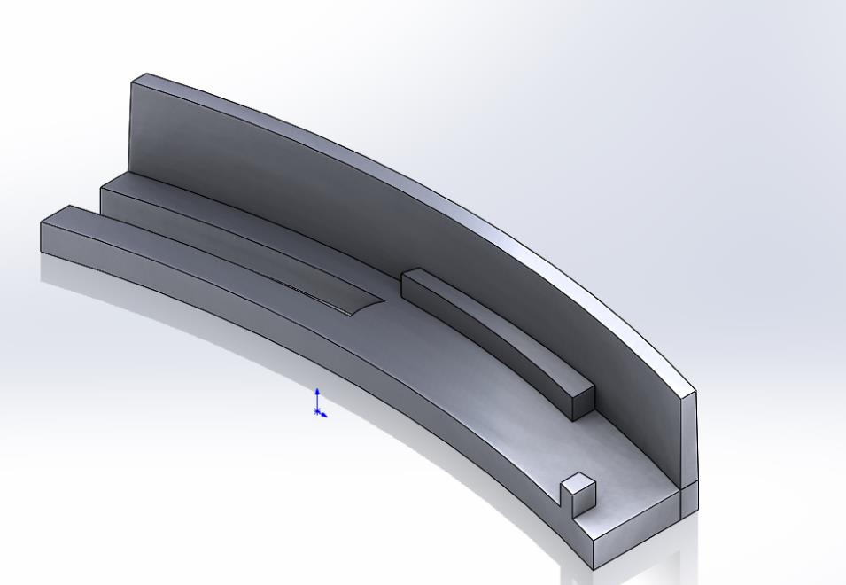

**Figure 43: Vacuum Cup and its Specifications.**

### Vacuum Gripper Mount

The vacuum gripper is assembled on the gripper actuator using a gripper mount which gives it a sturdy and support structure as shown below. The mount is made of Aluminum 6061 material for its lightweight.

**Figure 44: Vacuum gripper assembled on the mount.**

### End of Arm Tooling Adapter Design

The end of arm tooling needs to finally be integrated into the robotic arm thus the need for an Adapter design. This adapter is designed in a way that provides maximum contact between the gripper actuator and the robot end link. Its large bore size enables it to have a high grip force to weight ratio and it is easily attached using bolts. This adapter is made out of 304 Stainless Steel for its strength, corrosion resistance, and compatibility with the manufacturing environment.

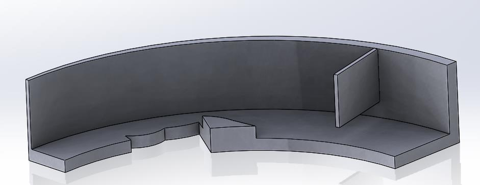

**Figure 45: Adapter to**

**Figure 46: Gripper Mount to Gripper Actuator**

The gripper is finally assembled on the robot end effector link, and this is the final look.

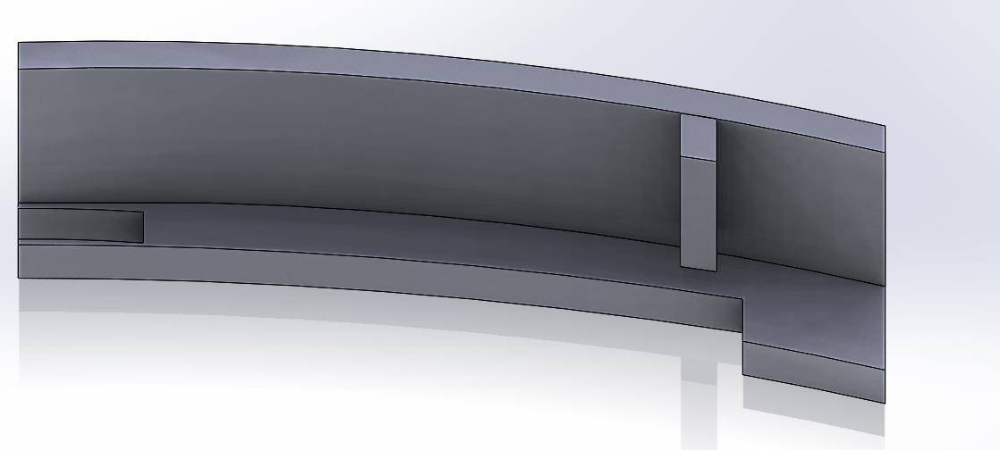

**Figure 47: Gripper Final Look assembled to Robot.**

---

## Finalized Grippers Design

This part of the report shows how all the parts of the redesigned product are held using the fingers and the vacuum gripper.

### Mouse Base Shell

The base part of the mouse is gripped from the inside using the side edges of the fingers. The fingers are curved so that they can fit into the shape of the mouse without making it fall.

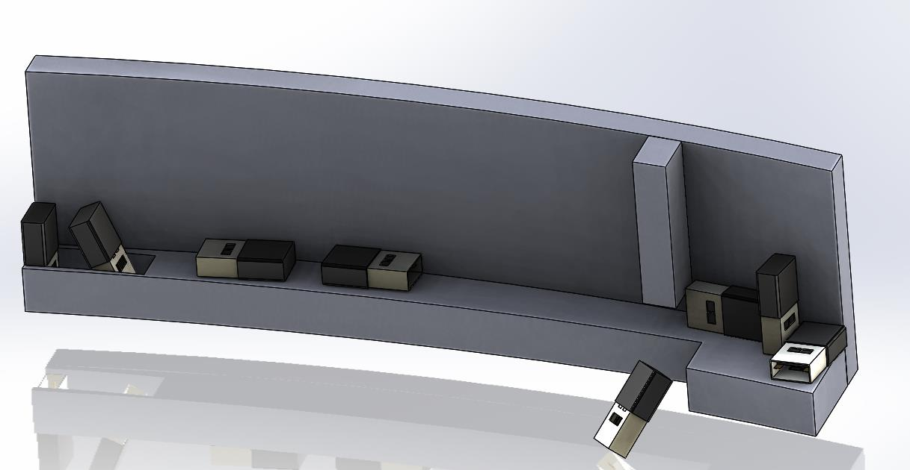

**Figure 48: Mouse Base internally gripped.**

### USB Bluetooth Dongle

The USB Bluetooth dongle is gripped at a stroke of 7mm. It is gripped vertically on the handle part of the USB, and it is assembled vertically to the mouse.

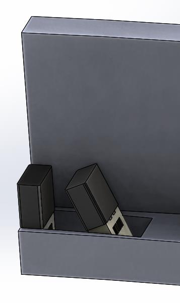

**Figure 49: USB Dongle on Parallel**

### PCB and Mouse Top

These are the parts w cup is positioned at the very center posit e to weight imbalance.

**Figure 50: PCB and Mouse Top Shell picked by Vacuum gripper.**

### Complete Mouse

The fingers are curved to fit into the shape of the mouse for easier grip and preventing it from damage or falling over. As for the flat space after the curved section to the finger, the fixture is made such that it can allow the fingers to move down until the curved section and grip the mouse then come up. The mouse is gripped at a stroke of 44m which is our largest stroke for our gripper.

**Figure 51: Complete Mouse picked by Gripper.**

---

## Robot selection

In our case, the selection of the EC63 6-axis robotic arm from Elite Robots was based on its payload capacity of 3 kg, which comfortably accommodates the total weight of the parts, including the gripper, calculated at 2.42465 kg. The robot's specifications, such as its 624 mm radius, ±0.02 mm repeatability, and 6-axis flexibility is ideal since we have two grippers fitted in one actuator, there will be vertical rotations of the gripper to allow the switching between the parallel finger gripper and the vacuum. The weights of the parts were determined and are shown in the table below.

**Figure 52: Weight of Components**

Below are the specifications for the robot from its datasheet.

**Figure 53: EC63 Robot Arm and its Specifications**

### Finalized Robot

Below is the finalized CAD model of the robot with the integration of the gripper and adapter with the robotic arm, ready for deployment in the automated assembly line.

**Figure 54: Robot final look assembly.**

---

## Design of Robotic Cell layout

The cell layout was designed with the robot being at the center of the work area and it has a measurement of (3000mm x2800mm) Length x width. The radius of the robot arm is 624mm and the bowl feeders are arranged in the clockwise direction to minimize the movement distance of the robotic arm to pick the components during the assembly. Except for the PCB component, it is placed near to the conveyor belt as it requires more space for placement of the palette feeder. The assembled mouse is picked and placed on the conveyor for packaging. Using the designed robotic layout, the cycle time for the assembly was calculated as the distance the parts delivered to robot work area were able to be determined. The distance is shown in the Figure 56.

**Figure 56: On-scale Robotic Cell Layout in 2D.**

---

## Safety system design

**Figure 57: Cell Safety Design**

### Zone 1

This zone is considered to be a general working area and does not run into risks of dangers coming from the robot arm workplace. However, the master lock switch for the robot arm is placed in this zone with multiple physical locks installed.

### Zone 2

In this zone, a fence is placed around the work area to separate Zone 1 and Zone 2. The size of the fence was decided to be 3048x4048 (mm) to accommodate the area for the workers to work on the feeders.

The entrance door into Zone 2 is designed to be 2040x820 (mm) as the minimum width and height of the door is 32 inches (812.8mm) and 80 inches (2032mm) respectively in accordance with the Internal Building Code (STANLEY Access, 2023). On the entrance door is a warning sign to remind the workers to priorities safety procedures in the work area. On the side of the door is a safety light, that is placed at eye-level, to indicate that the assembly process is running.

Emergency stop buttons are located at the front, right, and left side of the working area to ensure that the robot arm can be stopped at any moment by any worker on each site where the feeders are.

On the outside of Zone 3, there are 2 warning signs placed at the front and one on each side. These safety signs are to indicate that the workers are near high-risk areas, where they are close to the reach of the robot arm.

### Zone 3

In zone 3, safety tape is placed around the area to indicate that this is a dangerous area if no precautions are taken. The area covers 2048x2048 (mm) where it has a difference of 400mm distance away from the maximum reach of the robot arm at 624mm. This follows the ISO 10218-2 safety procedure where the minimum perimeter guard should be at least 400mm (Internation Organization for Standards, 2011).

Inside the area, pressure sensitive safety mats cover the floor as a safety feature. Whenever the safety mats detect the workers, the robot arm should stop all of the assembly process and its operation immediately.

At the back side of the zone is a safety light placed above the reach of the robot arm to indicate that the assembly process is ongoing to visitors and workers.

---

## Cycle time Analysis.

One of the objectives for automated assembly is the efficiency and time saved assembling a product. When a comparison is made on the time taken to assemble a product by manual and automated assembly, a drastic difference be automated assembly can output more products in less time. To calculate the cycle time of the whole assembly process, The assembly process is broken down into discrete motions, with each motion timed and analyzed to determine the total cycle time. The dimensions were first measured while considering dimensions of the joint of the robotic arm to the distance it will encompass or hold each component, respectively. There are total of eight motions that the robot needs to complete in one cycle of assembling the product.

### Steps for Assembly Process

**Motion 1**

Robot moves from the base to the feeder 1 with the mouse base, picks it up and places it on the fixture.

**Motion 2**

Robot moves from the fixture to the Mouse Optical Sensor, picks it up and ends the motion by placing it on the designated place on the mouse base.

**Motion 3**

Robot moves from the fixture to the PCB, rotates the joint 6 to interchange to vacuum gripper, picks up the PCB and ends the motion by placing it on mouse base.

**Motion 4**

Robot moves from the fixture to the scroll wheel, rotates the joint 6 to interchange gripper to parallel gripper, picks up the scroll wheel and places it on the PCB designated place.

**Motion 5**

Robot moves from the fixture to the mid mouse part, picks it up and ends the motion by placing it on top of the PCB, housing the PCB and the optical sensor to the mouse base.

**Motion 6**

Robot moves from the fixture to the USB Bluetooth dongle part, picks it up and ends the motion by placing it on the designated place on the mid mouse part.

**Motion 7**

Robot moves from the fixture to the top mouse shell, rotates the joint 6 to interchange to vacuum gripper, picks up the top mouse shell and ends the motion by placing it on top of the mid mouse part, covering it hence completing the mouse assembly.

**Motion 8**

Robot moves from the fixture to the PCB, rotates the joint 6 to interchange to vacuum gripper, picks up the PCB and ends the motion by placing it on mouse base.

**Figure 58: Vertical travel distance for Robotic Arm**

The dimension for the z-axis was approximated as 368.52mm for all the motions since the feeders would be placed at the same height in the working cell. The calculations for the total cycle time are calculated as shown below.

**Total Cycle Time**

Summing up all the times in the individual motions, our robot takes approximately 31.388 seconds to complete one cycle of assembling one product.

**Figure 59: Total Cycle Time in Steps**

---

## Economic Justification

For the economic justification for this project, the Payback period and ROI (Return of investment) was calculated to validate if the project proposal is worth the investment and to provide a total cost for the investment. Commonly, the investment cost or the initial investment done to replace the manual labor to automated assembly system should be easily repaid in a tenure of 2 ½ years.

The ROI is also to investigate further on money recuperated based on percentage per year which could provide a clear planning for the business owners.

Formula for Payback Period,

C is the total cost for robot build including the robot price, the construction cost for robot placement, the cost for bowls feeders, the cost of the grippers and end effectors and planning of the robot cell layout. Based on estimation, the cost of robot is 55% of the total robotic system cost, the tooling cost is 30% and another 15% for robot system installation. For the Robotic Arm EC63, the price is RM 74 152. So, the total cost will be RM 135 821.81

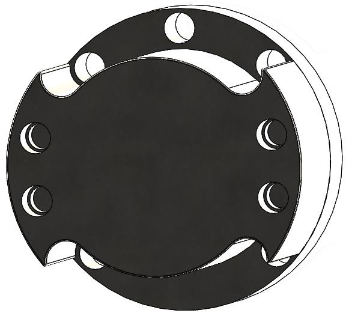

**Figure 60: Robot Price**

TC is the Investment tax credit. It can be calculated as 10% from C, which is the tax cut from purchasing the robot system. TC = RM 13 582.18

W is the annual salary of worker being replaced by the robot. The salary of a factory worker is Rm1500 from the study conducted on JobStreet. For a worker working 8 hours per day and 20 days a month, the hourly wage is Rm 9.375. Assuming the factory operates 24hours, it will require 3 workers to fill in the shift. In a year, the cost for 3 workers is Rm 54000.

I, is the money saved from the installation in productivity. It is takes 31.9701 to complete the assembly and including another 120s for packing will result in 151.97s. In average, it takes around 119s to assemble the plug and including another 60s for packing will be 189s.

Assuming the production is run 365 days, the production of mouse will be 197.1K of units minus the 5% of defect units and for normal assembly production will result in 166.7K units after the defect units of 5% in production line. The total revenue from the extra production will be RM 186,100.

The saving from insurance for 3 workers is Rm 5400.

I = Rm191 500

D is the robot depreciation allowance per year. A robot is assumed will be used for 8 years and has a salvage value of Rm10,000.

C-10000 / 8 = RM 15727.72

M is robot maintenance for purchase of parts, which is around 10% of the total cost C.

M= RM 13 582.18

S= Staffing cost for the robot

In the automation assembly system, it will require to hire new sets of staff to maintain the flow of the production. It will require 2 workers as operators and an engineer to maintain the work area for every robot. Based on the research on Glassdoor website, the annual salary for a Production Engineer is RM 42,000. The salary for the operator will be Rm 36000 (Rm1500x12x2worker) so the total cost for the staff,

S = RM 78000.

P = (C-TC) / (W+I+D-(M+S)) = 0.72

When one robot is used for the project, it will take 0.72years or 8.64 months to reacquire the investment spent.

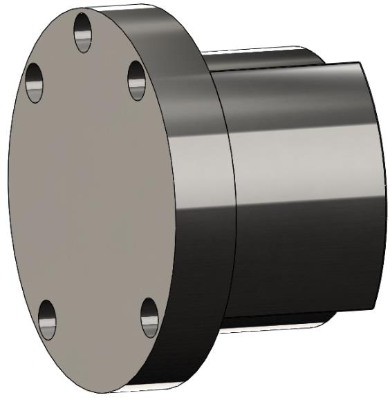

For the ROI, it can be calculated as 124.89% with the use of a single robot.

---

## Conclusion

The Automated Assembly Project for the wireless mouse represents a significant achievement in manufacturing efficiency. By transitioning from manual assembly processes to a fully automated system, the project is enhanced in production speed and efficiency in the assembly of wireless mice. The project successfully demonstrates the integration of robotic system, custom-designed gripper, feeders and fixturing system, and a well-thought-out assembly workflow.

The project team redesigned the wireless mouse components to be more automation-friendly, which facilitated easier handling and assembly by the robotic system. The use of dual gripper systems (parallel and vacuum grippers) allowed for versatile handling of various components, ranging from delicate parts like the PCB to more robust components like the mouse shells.

The cycle time analysis provided in the project proves the efficiency of the automated system, with a significant reduction in the time required to assemble a single unit compared to manual assembly methods. This efficiency gain not only boosts production throughput but also enhances the overall economic viability of the manufacturing process.

---

## Appendix/References

[1] Aluminum 6061-T6; 6061-T651. (n.d.). Material Properties Data. MatWeb. Available at:http://www.matweb.com/search/datasheet.aspx?matguid=aaaab01a606b4b0b8ad7e3b1a5be4a98 [Accessed 20 April 2024].

[2] Elite Robots. (2024). EC63 6-Axis Robotic Arm. [online] Available at: https://www.eliterobots.com/product-page/ec63 [Accessed 18 April 2024].

[3] ELITE ROBOTS EC63 Robots New In-Stock #571273 - MachineTools.com (no date) www.machinetools.com. Available at: https://www.machinetools.com/en/for-sale/571273-elite-robots-ec63-robots

[4] ISO 2011, ‘ISO 10218-2:2011 Robots and Robotics Devices – Safety Requirements for Industrial Robots: Part 2 Robot Systems and Integration', International Organization for Standards, accessed 10th April 2024, https://www.iso.org/standard/41571.html.

[5] Loh, E.J. n.d., ‘Working Safely with Industrial Robots', WSH Council, accessed 10th April 2024,https://www.tal.sg/wshc/-/media/TAL/Wshc/Resources/Publications/Others/Files/Working-Safely-with-Industrial-Robots.pdf.

[6] STANLEY Access Technologies n.d., 'Watch Your Head(er): Knowing Your Way Around Standard Commercial Door Specs', STANLEY Access Technologies, accessed 19th April 2024, Standard Commercial Door Heights, Widths, Specs, and Requirements | STANLEY Access Technologies.

[7] PARTS FEEDRS 2009, basic equipment price list, viewed 5 April 2014, < http://www.partsfeeders.com/pricing.htm>.

[8] PENSKE 2010, Casual Warehouse/Assembly Worker(Job Number: 1402852), viewed 5 April 2014, < https://gopenske.taleo.net/careersection/.penske.ex.jsa.hs/jobdetail.ftl?job=1402852&src=JB-10126&id=2055270-1818-210&src=JB-10126>.

[9] Schmalz, 2024. Spring Plunger FSTE M5-IG 20. Components Catalog. [pdf] Schmalz. Availableat:https://pimmedia.schmalz.com/MAM_Library/Dokumente/Publikation/Kataloge_Broschueren/Catalog_Schmalz_Komponenten_ED15_en-EN.pdf [Accessed 18 April 2024].

[10] Schmalz, 2024. Spring Plunger FSTE M5-IG 20. Components Catalog. [pdf] Schmalz. Available at: https://pimmedia.schmalz.com/MAM_Library/Dokumente/Publikation/Kataloge_Broschueren/Catalog_Schmalz_Komponenten_ED15_en-EN.pdf [Accessed 18 April 2024].

[11] Schmalz, 2024. Spring Plunger FSTE M5-IG 20. Components Catalog. [pdf] Schmalz. Available at: https://pimmedia.schmalz.com/MAM_Library/Dokumente/Publikation/Kataloge_Broschueren/Catalog_Schmalz_Komponenten_ED15_en-EN.pdf [Accessed 18 April 2024].
