# RME40003 Robot System Design

## Project Report

### Hand-Eye Coordination Project

**Logarajan Muthu | 4302281**

**Abdulswamad Rama Salim | 101229220**

**Mohd Afif Jazimin Bin Mohamad Norzaidin | 102763305**

**Lecturer: Ir. Dr. Hudyjaya Siswoyo Jo**

**28 May 2024**

---

## Contents

- [1. Introduction](#1-introduction)
    - [1.1 Objectives](#11-objectives)
- [2. Project Timeline and Work Distribution](#2-project-timeline-and-work-distribution)
- [3. Image Acquisition and Processing](#3-image-acquisition-and-processing)
    - [3.1 Camera Calibration](#31-camera-calibration)
    - [3.2 Checkerboard Calibration](#32-checkerboard-calibration)
- [4. Image Processing](#4-image-processing)
    - [4.0.1 Image Capturing](#401-image-capturing)
    - [4.0.2 Undistort Image](#402-undistort-image)
    - [4.0.3 Coordinate Offsets](#403-coordinate-offsets)
    - [4.0.4 Grayscale Image](#404-grayscale-image)
    - [4.0.5 Thresholding](#405-thresholding)
    - [4.0.6 Image Masking](#406-image-masking)
    - [4.0.7 Region Properties](#407-region-properties)
    - [4.0.8 Properties Arrangement](#408-properties-arrangement)
    - [4.0.9 Results](#409-results)
- [5. Module Interfacing and Robot Arm Programming](#5-module-interfacing-and-robot-arm-programming)
    - [5.1 Communication Setup:](#51-communication-setup)
    - [5.2 Movement and Sorting:](#52-movement-and-sorting)
    - [5.3 Data Transmission:](#53-data-transmission)
- [6. Forward and Inverse Kinematics Analysis: ABB IRB 120](#6-forward-and-inverse-kinematics-analysis-abb-irb-120)
    - [6.1 Objectives](#61-objectives)
    - [6.2 Choice of Robot](#62-choice-of-robot)
    - [6.3 Kinematic Representation](#63-kinematic-representation)
    - [6.4 Computing Forward Kinematics](#64-computing-forward-kinematics)
    - [6.5 Inverse Kinematics](#65-inverse-kinematics)
- [7. Development of 3D model and animation](#7-development-of-3d-model-and-animation)
    - [7.1 Challenges encountered during 3D model animation](#71-challenges-encountered-during-3d-model-animation)
- [8. Conclusion](#8-conclusion)

---

## 1. Introduction

This project on Hand-Eye Coordination is about automating a visually guided pick and place opera- tion using a robotic manipulator. The robot being operated on is physical but also robot simulation is done extensively using the RobotStudio® software. The team was given access to both the software through a Network license and the E213 Robotics Lab at Swinburne to have access to the physical robot. Other than the pick and place task, the third task involved calculating and determining the forward and inverse kinematics of the ABB IRB 120 robot manipulator. This involved the use of the Robotics Toolbox for MATLAB® developed by Peter Corke. The toolbox helped in visualizing the robot dh parameters and also later it would be used to animate the robot's pick and place operation.

### 1.1 Objectives

- To study image processing application
- To apply the algorithm in MATLAB to obtain the rectangular bar region properties
- To study robot operation and starter program
- To develop robot program for pick and place from fixed positions
- To develop communication between MATLAB and RAPID

---

## 2. Project Timeline and Work Distribution

Below is the project timeline and distribution throughout this project.

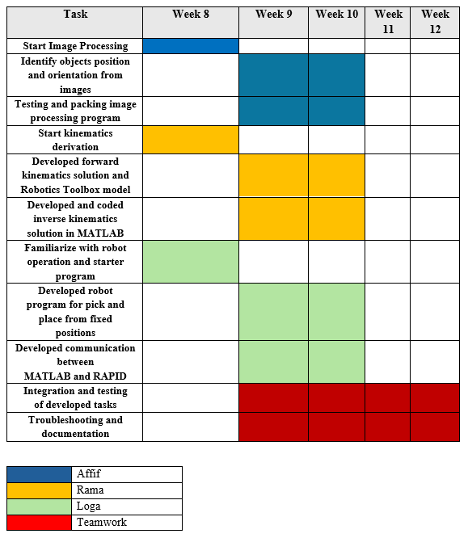

**Figure 1: Project timeline and Work Distribution**

---

## 3. Image Acquisition and Processing

### 3.1 Camera Calibration

Calibrating the camera is a crucial process to correct the fish-eye distortion of the camera. In this case, the camera was placed above the working area of the robot arm. Distortions made from this phenomenon increases the inaccuracy of the system to correctly identify the exact variables of the rectangular bars in terms of area, position, and orientation in the workspace. The necessary informa- tion to calibrate the camera are the focal length, lens distortion coefficient, and the principal point. These parameters assist in the calibration process for the fish-eye distortion and corrects the captured image. For the calibration, a checkerboard was used to establish a calibration pattern and to obtain the image coordinates in respect to the world coordinate system. The estimation for the parameters and distortion coefficients through the calibration algorithm is possible when the point coordinates are matched together. Once the parameters are known, they were used to undistort the images captured by the camera. The process is done by applying geometric transformations to each of the captured images in order to produce an image with less distortion due to the fish-eye distortion.

### 3.2 Checkerboard Calibration

A few samples of images of the checkerboard in various positions were taken and was stored in the variable ‘imgCheck’ in the ‘img’ directory.

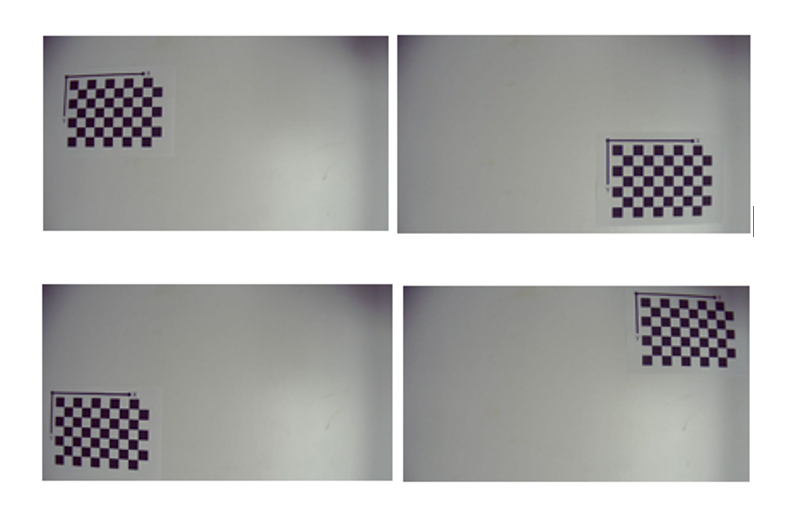

**Figure 2: Checkerboard calibration.**

The `vision.calibration.monocular.CheckerboardDetector()` function is used to identify a calibration pattern, specifically a checkerboard, in the acquired images. This function automatically locates the corners of the checkerboard pattern, which are crucial for calibration.

The `detectPatternPoints()` function takes the checkerboard detector and the image file names as inputs, returning the detected pattern points in the images. It identifies the positions of the checkerboard corners, enabling precise calibration.

The variable `originalChecker` holds the first image from the image file names. This im- age is used to determine the image size, which is important for subsequent processing steps. The `generateWorldPoints()` function creates the world coordinates for the key points of the pla- nar pattern, specifically the corners of the checkerboard pattern in this case. These coordinates are essential for calibration and mapping image points to a 3D coordinate system.

The `estimateCameraParameters()` function handles the camera calibration using the de- tected image points and their corresponding world points. It calculates the intrinsic and extrinsic parameters of the camera, including focal length, principal point, and distortion coefficients. The results of this calibration are stored in the `cameraParams` variable.

The `showReprojectionErrors()` function displays the reprojection errors of the calibra- tion. It shows the discrepancies between the observed image points and the points reprojected using the calibrated camera parameters. This visualisation helps assess the accuracy of the calibration and identify any inconsistencies or outliers.

The `showExtrinsics()` function visualises the positions of the pattern and the camera’s ex- trinsic parameters. It offers a visual representation of the relative positions of the camera and the detected pattern in 3D space. This helps verify the calibration accuracy and understand the spatial relationships.

The `undistortImage()` function corrects lens distortion in the acquired images using the `cameraParams`. It applies a correction to produce undistorted images, which are then used for subsequent image processing and analysis.

---

## 4. Image Processing

The detection and analysis of the object was secure in this part of the process and the results provided are the centroid coordinates, area, and orientation of the rectangular bars. The data collected are necessary for the robot arm to be able to accurately pick the appropriate rectangular bar in order based on the visual input.

### 4.0.1 Image Capturing

For testing, a sample image that was previously collected was used for object detection. The function `imread()` reads the ‘p1.jpg’ image from the ‘img’ directory and stored it in a variable ‘I’.

```matlab
% Load image
I = imread('img/p1.jpg'); % image from folder
```

The original image obtained was:

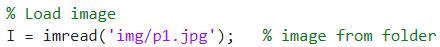

**Figure 3: Original obtained during image capture**

However, during demonstration for randomly placed rectangular bars, the function `snapshot()` was used to obtain a single image of the rectangular bars and store it in a variable 'I'.

```matlab
% cam = webcam;
% I = snapshot(cam); % image from lab camera
```

### 4.0.2 Undistort Image

In order to obtain an undistorted image of the rectangular bars, the function `undistortImage()` was used to remove the lens distortion present from the recently captured image. This is further assisted by the ‘cameraParams’ obtained during the camera calibration process. Furthermore, the image was set to rotate by -0.51 degrees to correct any minor misalignment. The scale of the image was then resized with the function ‘imresize()’ from pixels to centimeters by dividing the height and width by 2.54 according to the value obtained from the camera calibration.

```matlab
% Image processing
img = undistortImage(I, cameraParams);
img = imrotate(img, -0.51);
scale_width = 1920 / 2.54;
scale_height = 1080 / 2.54;
img = imresize(img, [scale_height, scale_width]);
img = img(21:end-20, 21:end-20, :);
```

### 4.0.3 Coordinate Offsets

Offset adjustments of the x and y coordinates were made through trial and error. In this case, x- coordinate was offset by -335 and y-coordinate was offset by 204.

```matlab
% Offset adjustments
xoffset = -335;
yoffset = 204;
```

### 4.0.4 Grayscale Image

To clear the captured image further, the function `rgb2gray()` was used to changed it to black and white if it contains any Red, Green, Blue (RGB) values.

```matlab
% Convert the image to grayscale if it's RGB
imgGray = rgb2gray(img);
```

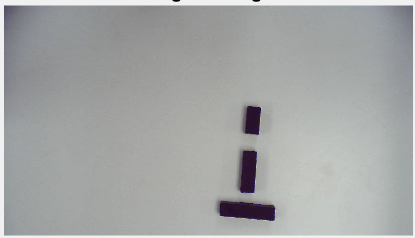

**Figure 4: Grayscale Image**

### 4.0.5 Thresholding

Image thresholding value was set at 40 and this process was to convert the grayscale image before to a binary image. The grayscale image was set to be above or equal to the threshold value to have the pixels above the threshold to be set as 1 for the rectangular bars while pixels below threshold were set to 0 to represent the background. To further enhance the image, the function ‘bwareaopen()’ was used to remove small objects from the binary image with less than 1000 pixels.

```matlab
% Set the threshold for removing tiny details
threshold = 40;
binaryImg = imgGray >= threshold;
minArea = 1000; % Adjust this threshold area as needed
binaryImgCleaned = bwareaopen(~binaryImg, minArea);
```

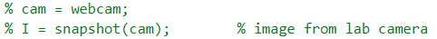

**Figure 5: Thresholding Image**

### 4.0.6 Image Masking

The image was then masked by inverting the binary image with the function `binaryImgCleaned()` to identify the areas to be masked out. The value ‘[1, 1, 3]’ specifies the replicated inverted binary image from the ‘repmat()’ function across the the RGB colour channels to create a 3-dimensional mask. The 3D mask to set the corresponding pixels in the `maskedImg()` function to black, thereby masking out (removing) the unwanted areas in the image.

```matlab
% Masking the image
maskedImg = img;
maskedImg(repmat(~binaryImgCleaned, [1, 1, 3])) = 0;
```

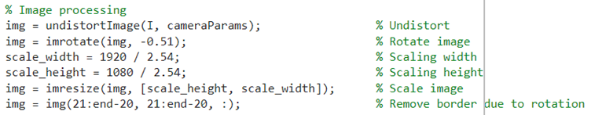

**Figure 6: Image masking.**

### 4.0.7 Region Properties

For detecting the properties, the function `regionprops()` was used in order to obtain the prop- erties such as the centroid of the rectangular bars, the bounding box, the orientation, and the area of individual bars. The centroid and bounding box were stored in variable ‘s’, orientation in variable ‘o’, and area in variable ‘area’.

```matlab
% Detect properties
s = regionprops(binaryImgCleaned, 'Centroid', 'BoundingBox');
o = regionprops(binaryImgCleaned, 'Orientation');
area = regionprops(binaryImgCleaned, 'Area');
```

### 4.0.8 Properties Arrangement

An empty array for the bars called variable ‘BarArr’ was initalised to store the properties obtained beforehand. A for loop was used to iterate over each detected bars and ‘numel(o)’ returns the number of elements in ‘o’, which is the orientation of the object. The centroid and orientation properties were extracted for the i-th element. ‘s(i).Centroid retrieves the centroid coordinate (x,y) of the i-th element from variable ‘s’ that which contains the region properties. The orientation angle were obtained by ‘o(i).Orientation’ of the i-th element from variable ‘o’. The original orientation was then adjusted according to the value according to 0. A positive value would be subtracted by 90 degrees while a negative value would be to add by 90 degrees. This was made to align to the axis and to the desired range. The centroid coordinates obtained were adjusted according to the offset values.

```matlab
BarArr = [];
% Loop through each detected object
for i = 1:numel(o)
    % Extract centroid and orientation for the current object
    centroid = s(i).Centroid;
    orientation = o(i).Orientation;
    % Adjust orientation
    if orientation > 0
        orientation = orientation - 90;
    else
        orientation = orientation + 90;
    end
    % Calculate adjusted coordinates
    sendX = centroid(2) + yoffset;
    sendY = centroid(1) + xoffset;
    sendR = orientation;
    % Store object properties in BarArr array
    BarArr(end+1, :) = [sendX, sendY, sendR, area(i).Area];
end
```

To enable the robot arm to pick the rectangular bars to form a pyramid, the bar array ‘BarArr’ was then rearranged so that the elements are in a descending order according to the area of the rectangular bar. This is achievable by the ‘sort()’ function on the array.

```matlab
% Sort BarArr based on the area in descending order
[~, sortIdx] = sort(BarArr(:, 4), 'descend');
sortedBarArr = BarArr(sortIdx, 1:3);
```

### 4.0.9 Results

The elements of the bar array were then displayed in the terminal according to x-coordinate, y- coordinate, and orientation.

```
564.6774    93.9149   83.4827
491.7309    96.9532   -4.4490
397.7599   105.7733   -5.5570
```

The result can show the centroid coordinates and area of the rectangular bars on the image itself while the orientation is shown in the terminal below.

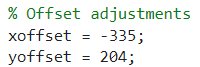

**Figure 7: Processed Image**

A compilation of the obtained region properties of the rectangular bars can be summarised in a table in accordance to area, coordinates, and orientation.

The discrepancy between the data from the terminal and from the image is due to the offsets being applied to the x and y-coordinates.

**Table 1: Object Coordinates**

| Area | Coordinates (x, y) | Orientation |
| :--- | :--- | :--- |
| 2514 | (429, 361) | 83.4827 |
| 1817 | (432, 288) | -4.4490 |
| 1191 | (441, 194) | -5.5570 |

---

## 5. Module Interfacing and Robot Arm Programming

The module for interfacing and programming the robot arm in ABB RobotStudio® involved es- tablishing bidirectional communication between MATLAB and the robot controller to enable efficient pick and place operations. The RAPID programming language was employed to develop the robot program, allowing it to receive real-time instructions from MATLAB based on object properties iden- tified through image processing.

### 5.1 Communication Setup:

Interfacing of MATLAB and RobotStudio in Client/Server Communication:

**MATLAB (Client):**

MATLAB is responsible for performing image processing and identifying the properties of the objects to be manipulated. It sends the coordinates, rotation angles, and properties of these objects to the robot controller over a socket connection. MATLAB also receives acknowledgment messages from the robot controller to confirm that the data has been received and processed correctly.

**ABB RobotStudio (Server):**

The robot controller, programmed in RAPID within RobotStudio, acts as the server in this setup. It listens for incoming connections from MATLAB and receives data strings representing the objects’ properties.

```rapid
MODULE Module1
    VAR socketdev server_socket;	    ! Declare server socket variable
    VAR socketdev client_socket;	    ! Declare client socket variable
    VAR num X1, Y1, R1, p1;		    ! Variables for the first object's coordinates, rotation, and property
    VAR num X2, Y2, R2, p2;		    ! Variables for the second object's coordinates, rotation, and property
    VAR num X3, Y3, R3, p3;		    ! Variables for the third object's coordinates, rotation, and property
    CONST robtarget stackPoint{3}:=[ 	    ! Define the stack points for the objects
        [[0,500,0],[0,0,1,0],[0,0,0,0],[9E+09,9E+09,9E+09,9E+09,9E+09,9E+09]],
        [[0,500,25],[0,0,1,0],[0,0,0,0],[9E+09,9E+09,9E+09,9E+09,9E+09,9E+09]],
        [[0,500,50],[0,0,1,0],[0,0,0,0],[9E+09,9E+09,9E+09,9E+09,9E+09,9E+09]]
    ];
    VAR num index{3};			    ! Array to hold the property values for sorting
    PROC main()
        rHome;				    ! Move to home position
        socketTest;			    ! Execute socket communication procedure
        Move1;				    ! Execute movement procedure
        rHome;				    ! Return to home position
    ENDPROC
```

**Main Procedure (main()):**

The main procedure `main()` first calls `rHome()` to move the robot arm to the home position. It then executes the `socketTest()` procedure to establish the communication and receive data from MATLAB. Once the data is received, it is stored in an array (`index`) for sorting based on the properties of the objects.

The robot program begins with the declaration of server and client socket variables (`server_socket` and `client_socket`). These sockets are essential for establishing the communication link be- tween MATLAB and the ABB robot system. MATLAB acts as the client, sending data to the robot controller, which operates as the server, receiving and processing the data to execute the desired pick and place operations.

The `socketTest()` procedure handles the entire socket communication process. Initially, the server socket is created and configured with the `SocketCreate` and `SocketBind` commands. The server listens for incoming connections using `SocketListen`, and once a connection is ac- cepted, `SocketAccept` establishes the communication link between the server and the client socket.

MATLAB sends data strings, which are received by the robot system using the `SocketReceive` function. These strings represent coordinates and properties of objects that need to be manipulated. The received data is converted from string format to numerical values using the `StrToVal` function and stored in predefined variables (X1, Y1, R1, p1) for each bar. After receiving and converting the data, the robot sends back acknowledgment messages to MATLAB using the `SocketSend` function.

```rapid
pickTargets1.trans := [X1, Y1, 0]; pickTargets1.rot := OrientZYX(R1, 0, 180);
pickTargets2.trans := [X2, Y2, 0]; pickTargets2.rot := OrientZYX(R2, 0, 180);
pickTargets3.trans := [X3, Y3, 0]; pickTargets3.rot := OrientZYX(R3, 0, 180);
```

This part initializes the `pickTargets` array with the coordinates and rotations of the three bars. Each `pickTargets` element corresponds to a bar, with its position (trans) and orientation (rot) defined based on the received X, Y, and R values.

### 5.2 Movement and Sorting:

In the `Move1` procedure, a bubble sort algorithm sorts the objects based on their properties. The sorted coordinates are then used to move the robot to each object’s position. The `MoveToObject` proce- dure performs detailed pick and place actions, including moving to the object’s location, gripping it, and placing it at the specified stack point. This involves precise movements defined by the `MoveL` commands, ensuring accurate positioning and manipulation of the objects within the workspace. The robot returns to the home position after completing the operations.

The `Move1()` procedure performs a bubble sort on the properties of the objects. This ensures that the objects are manipulated in the desired order. After sorting, the `MoveToObject()` procedure is called for each object to move it to its designated stack position.

The `Move1()` procedure is central to the operation, handling the sorting of objects based on their properties and subsequently moving them to their designated stack positions. The procedure begins by implementing a bubble sort algorithm to arrange the objects. This sorting process utilizes a nested `FOR` loop, where the outer loop runs from 1 to 2, ensuring all elements are compared, and the inner loop runs from 1 to 3-i, facilitating the comparison of adjacent elements.

During each iteration of the inner loop, the property values of the current object (stored in the `index` array) are compared with the next object. If the current object’s property value (`index{j}`) is greater than that of the next object (`index{j+1}`), a swap operation is initiated. This involves interchanging the elements within the `stackPoint` array, which holds the positions of the objects, to reflect the correct order. Additionally, the `Swap()` function is invoked to exchange the property values in the `index` array, ensuring both arrays remain synchronized.

Following the sorting process, the procedure proceeds to execute the movements of the objects. A `FOR` loop runs from 1 to 3, corresponding to the number of objects to be moved. Within this loop, the `MoveToObject()` procedure is called for each sorted position in the `stackPoint` array. This method ensures that each object is moved to its accurately sorted stack position, completing the sequence of operations. By utilizing the bubble sort algorithm and systematically calling the `MoveToObject()` procedure, the `Move1()` procedure ensures precise and efficient handling of the objects, fulfilling the requirements of the pick-and-place task.

The `MoveToObject()` procedure handles the detailed movements of the robot arm. It moves the arm to a position above the object, grips the object, lifts it, and places it in the designated stack position. This is achieved through a sequence of `MoveL` commands, ensuring smooth and precise movements. The `Reset DO_0_Grip` and `SetDO DO_0_Grip, 1` commands control the gripper to hold and release the objects appropriately.

Finally, after completing the pick and place operations, the `rHome()` procedure returns the robot arm to its initial home position, ensuring a safe and organized conclusion to the task. The robot controller processes the received data, converts it to numerical values, and uses this information to execute the pick and place operations. After processing the data, the robot sends acknowledgment messages back to MATLAB to confirm successful communication and execution.

```matlab
% Send each object's coordinates
for idx = 1:size(sortedBarArr, 1)
    pnet(con, 'printf', num2str(sortedBarArr(idx, 1)));
    pnet(con, 'readline');
    pnet(con, 'printf', num2str(sortedBarArr(idx, 2)));
    pnet(con, 'readline');
    pnet(con, 'printf', num2str(sortedBarArr(idx, 3)));
    pnet(con, 'readline');
    pnet(con, 'printf', num2str(idx)); % p value based on the order
    pnet(con, 'readline');
end
```

### 5.3 Data Transmission:

The data sent between MATLAB and the RAPID program consists of the bar coordinates (X, Y), rota- tion (R), and a property value (p). The communication follows these steps:

1.  MATLAB establishes a TCP/IP socket connection to the robot controller.
2.  MATLAB sends the X coordinate of the first bar.
3.  RAPID receives the X coordinate and sends an acknowledgment back to MATLAB.
4.  MATLAB sends the Y coordinate of the first bar.
5.  It is repeated for the R and p values of the first bar and continues for the subsequent bars.
6.  After receiving all coordinates, the RAPID program processes the data for pick and place oper- ations.

---

## 6. Forward and Inverse Kinematics Analysis: ABB IRB 120

The task of solving the inverse kinematics for the ABB IRB 120 robot arm is a critical challenge in robotic system design and trajectory planning. Inverse kinematics involves calculating the joint angular positions required to achieve a desired position and orientation of the robot’s end-effector. This process is a reverse computation of forward kinematics, where the known joint angles determine the position and orientation of the end-effector. The aim of solving an inverse kinematics solution is to enable the robot arm to interact with its environment in a controlled and predictable manner. This is essential for tasks requiring precision and repeatability. It is also important to note that the solution to the inverse kinematics problem is not unique, meaning that multiple joint configurations can result in the same end-effector position and orientation. Due to its mechanical constraints, the IRB 120 can have up to four different configurations to achieve a targeted end-effector state.

### 6.1 Objectives

1.  To create a three-dimensional representation of the ABB IRB 120 robot using the Robotics Toolbox for MATLAB® in the open-source MATLAB® environment.
2.  To derive and solve the forward and inverse kinematics equations for the ABB IRB 120 robot.
3.  To simulate the robot motion using the Robotics Toolbox for MATLAB® with the implemented inverse kinematics solutions.

### 6.2 Choice of Robot

For this task, the ABB IRB 120 is used. This robot is known for its compact and agile design, which makes it suitable for a wide range of applications. The IRB 120 is an articulated robot with six degrees of freedom (DOF), allowing for complex movements and high flexibility in task execution.

The key specifications of the ABB IRB 120 robot are as follows:

-   Degrees of Freedom (DOF): 6
-   Payload Capacity: 3 kg
-   Reach: 580 mm
-   Repeatability: ±0.01 mm
-   Weight: 25 kg
-   Wrist Type: Spherical wrist

The IRB 120’s spherical wrist and six axes of movement provides the need for precision in its op- eration. Its lightweight design, combined with enough payload capacity relative to its size, makes it an ideal choice for educational institutions and learning purposes as well. The robot’s dimensions, gotten from the datasheet are as shown below:

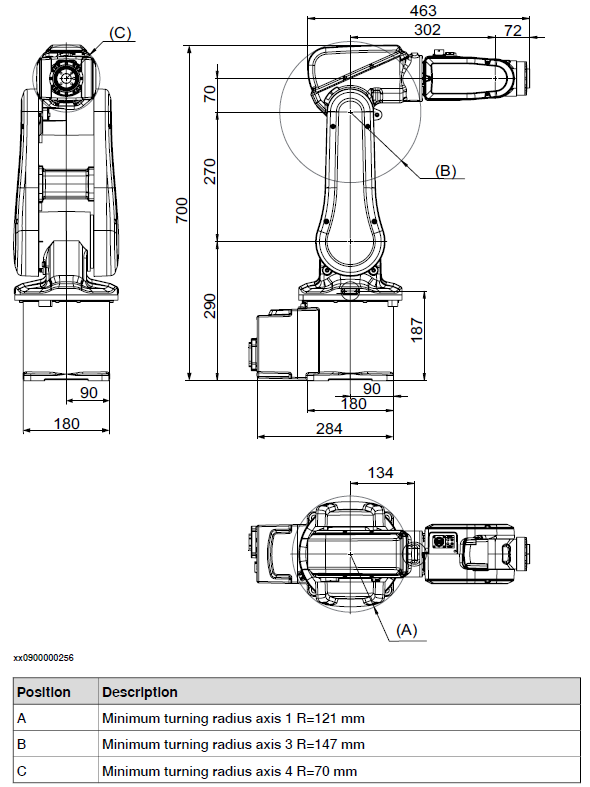

**Figure 8: ABB IRB 120 Robot Dimensions**

### 6.3 Kinematic Representation

Numerous methods exist for the kinematic representation of robot manipulators, and in this task, we will be using the formulation introduced by Denavit and Hartenberg. The D-H parameters are a set of four values that define the relative position and orientation between adjacent links in a robotic arm. For each joint/link of the robot, the following parameters are assigned:

-   *a*i: The distance along the common normal from the z-axis of the previous joint to the z-axis of the current joint.
-   *α*i: The angle about the common normal from the z-axis of the previous joint to the z-axis of the current joint. This describes the orientation of one link relative to the previous link.
-   *d*i: The offset distance along the previous z-ax s to the common normal, which can vary for prismatic joints.
-   *θ*i: The angle about the previous z-axis from the previous x-axis to the current x-axis, which can vary for revolute joints.

The figure provided below illustrates the established coordinate systems for the Denavit-Hartenberg links as displayed on the manipulator.


**Figure 9: ABB IRB 120 Robot with assigned coordinate frames**

After defining the coordinate system, the robot’s configuration can be represented using the four D- H parameters explained previously: the joint angle(θi), link length(di), offset distance(ai), and twist angle(αi). Table 1 gives the D-H parameters associated with each link.

**Table 2: DH Parameters of ABB IRB 120**

| θ | d (mm) | a (mm) | α (rad) |
| :-- | :--- | :--- | :--- |
| θ1 | 290 | 0 | -π/2 |
| θ2 - π/2 | 0 | 270 | 0 |
| θ3 | 0 | 70 | π/2 |
| θ4 | 302 | 0 | -π/2 |
| θ5 | 0 | 0 | π/2 |
| θ6 + π | 72 | 0 | 0 |

For a serial-link manipulator with n joints, the position and orientation of the end-effector with respect to the base frame can be determined by the product of n homogeneous transformation matrices Ai, each representing the transformation from frame i − 1 to frame i. The transformation matrix for joint i is given by:

Ai = Rot(z, θi) · Trans(z, di) · Trans(x, ai) · Rot(x, αi)

where the rotation and translation matrices are defined as:

```
cos(θi)  -sin(θi)  0  0
sin(θi)   cos(θi)  0  0
  0          0      1  0
  0          0      0  1
```

```
1  0  0  0
0  1  0  0
0  0  1  di
0  0  0  1
```

```
1  0  0  ai
0  1  0  0
0  0  1  0
0  0  0  1
```

```
1  0      0        0
0  cos(αi) -sin(αi)  0
0  sin(αi)  cos(αi)  0
0  0      0        1
```

### 6.4 Computing Forward Kinematics

To calculate the forward kinematics of the ABB IRB120 robot, we multiplied all the six A matrices to obtain the final transformation matrix. Alternatively, we used the `fkine` [2] method provided by the Robotics Toolbox for MATLAB® to confirm if our matrix multiplication was correct and it provided the same values. This method simplifies the process of computing the forward kinematics by taking the joint angles as input and returning the homogeneous transformation matrix representing the pose of the robot’s end-effector. Given a set of joint angles, the `fkine` function computes the position and orientation of the end-effector. By comparing the computed end-effector position (px, py, pz) with the position obtained from the RobotStudio® simulation software (TCP), we can verify the accuracy of our forward kinematics model. If the positions match, it confirms that our forward kinematics computation is correct. The MATLAB® code for computing the forward kinematics is included in the appendix. After executing the MATLAB® code, we obtain the position and orientation of the robot’s end-effector. The results are then compared with the TCP values from the RobotStudio® simulation to validate the forward kinematics model. The output from MATLAB® is as shown below:

End-effector position: px = -163.9205700, py = -189.00, pz = 711.00

Full Transformation Matrix T:

```
 0.7704    0.1883   -0.6091   -163.9
-0.5529    0.6731   -0.4912   -189
 0.3174    0.7152    0.6227    711
      0         0         0         1
```

This output can be compared with the end-effector position obtained from the RobotStudio® simula- tion, which is given as:

-162.38 -190.32 711.02

It is depicted below:

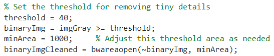

**Figure 10: Joint Jog interface showing the end-effector position in RobotStudio®.**

Given that the same joint angles are input into both the MATLAB® function and the RobotStudio® simulation, we can calculate the percentage error for the end-effector position coordinates to assess the accuracy of the forward kinematics model. The percentage error for each coordinate is calculated as follows:

Percentage Error = |(Actual Value - Simulated Value) / Simulated Value| × 100

For the px, py, and pz coordinates, the percentage errors are:

Percentage Error_px = |-163.92 - (-162.38)| / |-162.38| × 100 ≈ 0.95%

Percentage Error_py = |-189.00 - (-190.32)| / |-190.32| × 100 ≈ 0.69%

Percentage Error_pz = |711.00 - 711.02| / 711.02 × 100 ≈ 0.0028%

The slight differences observed between the MATLAB® output and the RobotStudio® simulation can be attributed to various factors, including numerical rounding errors in the computation, differences in the internal representation of joint angles, or slight variations in the robot model used in the simulation compared to the theoretical model used in the MATLAB® computation.

**Table 3: Percentage Error in End-Effector Position**

| Coordinate | MATLAB Value | Percentage Error |
| :--- | :--- | :--- |
| px | -163.92 | 0.95% |
| py | -189.00 | 0.69% |
| pz | 711.00 | 0.0028% |

### 6.5 Inverse Kinematics

Inverse kinematics for the ABB IRB 120 robot, which has six degrees of freedom (DOF) with all rev- olute joints and a spherical wrist, can be efficiently solved using the kinematic decoupling approach as described by Seth Hutchinson and Mark W. Spong in *Robot Modeling and Control* [1]. This approach simplifies the complex inverse kinematics problem into two manageable sub-problems: inverse posi- tion kinematics and inverse orientation kinematics [1].

#### 6.5.1 Kinematic Decoupling

The kinematic decoupling method is particularly useful for manipulators with six joints where the last three joint axes intersect at a common point, forming a spherical wrist [1]. Other types of robot manipulators can also have a spherical wrist in different setups like RPP + Spherical Wrist (R for Revolute, P for Planar), RRP Spherical Manipulator and so on. This allows the inverse kinematics problem to be divided into finding the position of the wrist center and determining the orientation of the wrist.

For a six-DOF manipulator with a spherical wrist, the inverse kinematics can be broken into two steps:

1.  **Position problem:** Finding the position of the wrist center (θ1,θ2,θ3).
2.  **Orientation problem:** Determining the orientation of the wrist (θ4,θ5,θ6).

![Figure 11: Illustration of Kinematic Decoupling [1]](assets/hand_eye_coordination/kinematic_decoupling_illustration.png)

**Figure 11: Illustration of Kinematic Decoupling [1]**

#### 6.5.2 Determining Origin of Spherical Wrist

So we will start our workings from the wrist centre, but the problem is we do not know where the wrist centre is, in terms of its coordinates / location. To find the location of the origin of the wrist, we will come back from the end effector (Joint 6) and offset by z6 to get to wrist position origin. This offset is 72 mm along the Z6 direction, and we use the last column of the rotation matrix to represent Z6 in the base frame. By subtracting this offset, we obtain the wrist center position (o_c^0):

o_c^0 = o_6^0 - d_6 z_6^0 = o_6^0 - 72 R_6^0

where o_6^0 is the end-effector position, d6 is the offset distance 72 mm, o_c^0 is the (px, py, pz) of the final transformation matrix, and R_6^0 is the unit vector along z6. To understand this better, this can be represented in component form as follows:

```
[xc]   [ox]   [r13]
[yc] = [oy] - d6[r23]
[zc]   [oz]   [r33]
```

where px, py, and pz are the components of the desired end-effector position, and r13, r23, and r33 are the elements of the third column of the rotation matrix R. This can be seen in the rough sketch below.

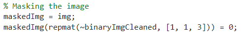

**Figure 12: Sketch of spherical wrist.**

Next, we define the transformation matrices (A1 to A6) for each joint using the DH parameter. These will be the inputs for the orientation of the object when we finally solve the inverse kinematics and have to input the position and orientation of the object to find the joint angles. In the MATLAB® code, this is implemented here:

```matlab
% Prompt for end effector position and orientation
O60 = input('Enter the end effector position as a 3-element vector [x; y; z]: ');
R60 = input('Enter the end effector orientation as a 3x3 rotation matrix: ');
Oc0 = O60 - 72 * R60(:,3); % wrist position
```

#### 6.5.3 Determining Position of Wrist (px, py, pz) of (T)

The location of the wrist depends only on θ1, θ2, and θ3. θ4 only accounts for the distance 302 mm because it rotates about axis Z3, which doesn’t change the position of the point.. So this means that we will only consider the transformation matrix from the DH parameters until the fourth A matrix.

T40 = A1 · A2 · A3 · A4

In the MATLAB code, the function this is implemented here:

```matlab
T40 = A1*A2*A3*A4;
disp('Wrist position (considered upto link 4)');
wp = simplify(T40(1:3,4)); % last column, px py pz
disp(wp)
```

#### 6.5.4 Determining θ1, θ2, and θ3

After having determined the wrist center position from MATLAB, T, it is given by:

```
[ 2*cos(θ1)*(151*cos(θ2+θ3) + 35*sin(θ2+θ3) + 135*sin(θ2)) ]
[ 2*sin(θ1)*(151*cos(θ2+θ3) + 35*sin(θ2+θ3) + 135*sin(θ2)) ]
[ 270*cos(θ2) + 2*sqrt(24026)*cos(θ2+θ3+atan(151/35)) + 290 ]
```

Since the position depends only on θ1, θ2, and θ3, we can solve for these angles.

For θ1:

The wrist center’s x and y coordinates can be written as:

px = 2 cos(θ1) k

py = 2 sin(θ1) k

where

k = 151 cos(θ2 + θ3) + 35 sin(θ2 + θ3) + 135 sin(θ2)

By eliminating k, we have:

tan(θ1) = py / px

θ1 = tan⁻¹(py/px)

For θ2 and θ3, using trigonometric identities:

sin(θ1)cos(θ2) + C1 sin(θ2) = S12

cos(θ1)cos(θ2) – S1 sin(θ2) = C12

where C1 = cos(θ1), S1 = sin(θ1), C12 = cos(θ2 + θ3), and S12 = sin(θ2 + θ3).

Simplifying the z-coordinate of the wrist position:

pz = 270 cos(θ2) + 2√24026 cos(θ2 + θ3 + atan(151/35)) + 290

Using the trigonometric identity:

cos(a + b) = cos(a)cos(b) – sin(a)sin(b)

we can solve for θ2 and θ3 by substituting and simplifying the equations.

Since tan(β) = 151/35, we look for cos(β) and sin(β)

Using Pythagoras’ theorem,

a² + b² = c²

tan⁻¹(θ) = a/b ⇒ cos(θ) = a/c

c² = a² + b²

In tangent, c = a/tan(θ)

a² = (c · tan(θ))²

c² = a² + (a · tan(θ))²

c = a√1 + tan²(θ)

a = c / √1 + tan²(θ)

So cos(β) is:

cos(β) = 1 / √1 + tan²(β) = 1 / √1 + (151/35)² = 1 / √(1 + 22801/1225) = 1 / √(24026/1225) = 35/√24026

sin(β) = cos(β) · tan(β) = (35/√24026) · (151/35) = 151/√24026

So,

cos(θ2 + θ3 + β) = cos(θ2 + θ3) · (35/√24026) - sin(θ2 + θ3) · (151/√24026)

270 cos(θ2) + 2√24026 · [cos(θ2 + θ3) · (35/√24026) - sin(θ2 + θ3) · (151/√24026)] + 290

= 270 cos(θ2) + 70 cos(θ2 + θ3) – 302 sin(θ2 + θ3) + 290

Wrist position with Trigonometry simplification:

C1(302 cos(θ3) + 70 sin(θ2 + θ3) + 270 sin(θ2)) = Xc

S1(302 cos(θ3) + 70 sin(θ2 + θ3) + 270 sin(θ2)) = Yc

270 cos(θ2) + 70 cos(θ2 + θ3) - 302 sin(θ2 + θ3) + 290 = Zc − 290

Square the 3 equations to eliminate θ1, i.e., C1 and S1:

Xc² + Yc² + (Zc - 290)² = (302 cos(θ3) + 70 sin(θ2 + θ3) + 270 sin(θ2))² + (270 cos(θ2) + 70 cos(θ2 + θ3) - 302 sin(θ2 + θ3))²

Assuming it’s a quadratic equation:

(-b ± √b² - 4ac) / 2a

Substitute S3 into the equation:

C = A · C3 + B · √1 - C3²

C² = (A · C3)² + (B · √1 - C3)²

(A² + B²) · C3² – 2AC · C3 + (C² – B²) = 0

θ3 = cos⁻¹(roots([A² + B², -2AC, C² - B²]))

To solve for θ3, we can use either the cos⁻¹ function or the tan⁻¹ function. The possible solutions for θ3 are given by:

θ3 = cos⁻¹(roots([A² + B², -2AC, C² - B²]))

or using the tan⁻¹ function:

θ3 = tan⁻¹(√1 - D(1)², D(1))

The MATLAB® code for finding θ3 is as follows:

```matlab
% three equations from wrist position
A = 2 * (270^2);
B = 2 * 70 * 302 * 270;
% B=2*70*270;
%B=2*70*302; % correct one
C = xc^2 + yc^2 + (zc - 290)^2 - 302^2 - 70^2 - 270^2;
% D=acos(roots([A^2+B^2,-2*A*C,C^2-B^2]));
D = roots([A^2 + B^2, -2 * A * C, C^2 - B^2]);
% theta3 = D(1);
theta3 = atan2(sqrt(1 - D(1)^2), D(1));
```

#### 6.5.5 Calculating θ2

Once θ3 is known, we factor out the coefficients of θ2 from equation (3):

270C2 + 70C23 - 302S23 = Zc - 290

C2(270 + 70C3 - 302S3) + S2(-70S3 + 302C3) = Zc - 290

We can solve for θ2 by forming a quadratic equation:

C2(270 + 70C3 - 302S3) + S2(-70S3 + 302C3) = Zc - 290

The solution for θ2 in terms of the MATLAB code is obtained as follows:

θ2 = atan2(-√1 - D2², D2)

where D2 is obtained from solving the quadratic equation:

AA² + BB², -2AA · CC, CC² - BB²

with:

AA = 270 + 70 cos(θ3) - 302 sin(θ3)

BB = -70 sin(θ3) - 302 cos(θ3)

CC = Zc - 290

The value of θ2 is then converted to degrees:

θ2_deg = rad2deg(θ2)

The MATLAB® code for solving θ2 is as follows:

```matlab
AA = 270 + 70 * cos(theta3) - 302 * sin(theta3);
BB = -70 * sin(theta3) - 302 * cos(theta3);
CC = zc - 290;

% Solve the quadratic equation
DD = real(roots([AA^2 + BB^2, -2*AA*CC, CC^2 - BB^2]));
theta2 = real(atan2(-sqrt(1 - DD(2)^2), DD(2)));
theta2_deg = rad2deg(theta2);
fprintf('theta2 = %.3f radians, %.3f degrees\n', theta2, theta2_deg);
```

#### 6.5.6 Determining θ4, θ5, and θ6

From the given rotation matrix:

R_6^3 = R_3^0T R_6^0

where R_3^0 is the orientation matrix of the first three joints, and R_6^0 represents the orientation from the wrist frame to the end-effector frame [1].

Given R_6^3:

```
[ sin(θ4)sin(θ6) - cos(θ4)cos(θ5)cos(θ6)   cos(θ6)sin(θ4) + cos(θ4)cos(θ5)sin(θ6)  -cos(θ4)sin(θ5) ]
[ cos(θ4)sin(θ6) - cos(θ5)cos(θ6)sin(θ4)   cos(θ5)sin(θ4)sin(θ6) - cos(θ4)cos(θ6)  -sin(θ4)sin(θ5) ]
[ -cos(θ6)sin(θ5)                             sin(θ5)sin(θ6)                              cos(θ5)       ]
```

To determine θ4, θ5, θ6:

From the R_6^3 matrix:

θ5 = arctan2(√(R_3,1² + R_3,2²), R_3,3)

θ6 = arctan2(R_6,2, -R_6,1))

θ4 = arctan2(-R_6,2,3, -R_6,1,3))

---

## 7. Development of 3D model and animation

In this mini-task, we had to import the 3D model of the ABB IRB 120 robot into MATLAB® and then visualize it with Robotics Toolbox for MATLAB® developed by Peter Corke. From MATLAB’s own documentation as shown below, MATLAB® reads geometry models as stl files.

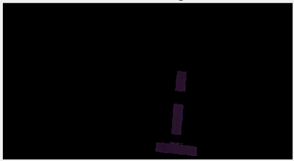

**Figure 13: stl file import into MATLAB®.**

So we would have to obtain the robot’s CAD models from the manufacturer’s website, then edit them on a 3D CAD Software into individual parts. This is because MATLAB® reads the .stl files for each link separately. The 3D model of the ABB 120 was found online but it was an assembly which was in .step format. I converted the individual parts into stl format and was using the SolidWorks’ Move and Rotate feature to orient the link’s origin so as it was consistent with the Denavit Hartenberg model (stick figure) we constructed earlier on MATLAB. I also had to scale down the modles by 1000 since the Robotics Toolbox uses metres as opposed to millimetres on SolidWorks. It is also important to note that upon reading on the book *Robotics Toolbox for MATLAB* by Peter Corke, he specified the package ARTE by Arturo Gil [3] which had already included the 3D models of some robots in the Robotics Toolbox (version 10.4), including the ABB IRB 120. The task would be as simple as downloading the stl files from ARTE’s library [3] and calling the function `Serialplot3D()`, while specifying the parameters.

![Figure 14: ARTE package by Arturo Gil [2]](assets/hand_eye_coordination/arte_toolbox_package.png)

**Figure 14: ARTE package by Arturo Gil [2]**

The 3D model simulation can be seen on the below image:

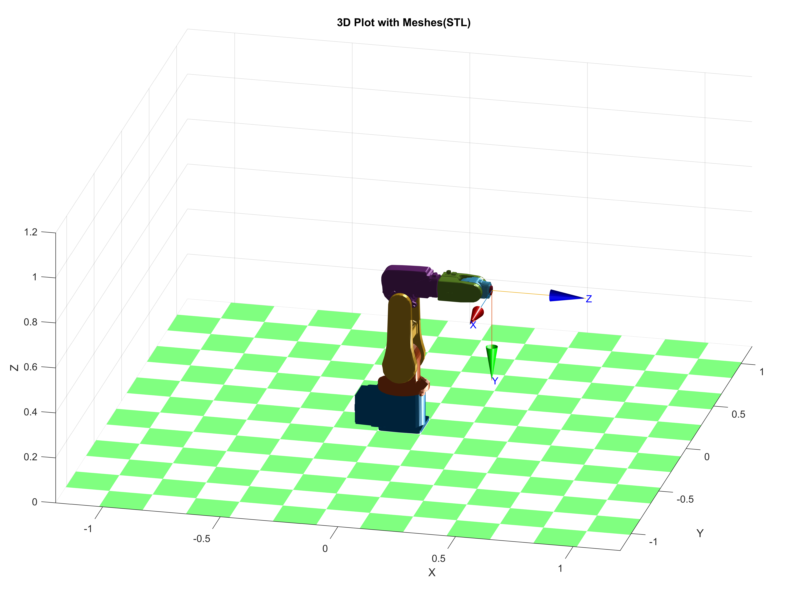

**Figure 15: 3D CAD Model Visualization on RTB**

### 7.1 Challenges encountered during 3D model animation

After successfully importing the 3D model of the robot into MATLAB, we tried to move the same way as the physical robot in the pick and place task. The image coordinates were to be obtained from the Image Recognition code and then input into the inverse kinematics solution. These inputs are three coordinates which is the image x, y and its orientation.

Unfortunately, this posed a challenge as our inverse kinematics solution failed to address this matter. To generate the appropriate joint angles, the inverse kinematics solution required the image / object’s x, y and z coordinates in 3d vector matrix as well as its orientation (px, py and pz). The inverse kinematics solution totally failed to address this issue and thus we could not animate the robot as based on the image coordinates. A suggestion was put that the image coordinates to be converted to 3d vector format and since the z coordinate is already known, then this would be input to the inverse kinematic solution. Further research and understanding needs to be done in this area and appropriate solution needs to be done especially when calculating inverse of a six degrees of freedom robot using the analytical way.

---

## 8. Conclusion

This project successfully demonstrates a robust method for integrating MATLAB® and RAPID for pick and place operations using socket communication. The RAPID program efficiently handles the data received from MATLAB®, sorts the objects based on a property value, and performs the pick and place operations to stack it at the `stackPoint` to form a pyramid structure. The integration between MATLAB® and the ABB robot controller through socket communication enables efficient and precise control of the robot arm for pick and place tasks based on real-time data from image processing. This setup can be adapted and extended for various industrial applications involving robotic automation. By implementing the kinematic decoupling approach, the inverse kinematics problem for the ABB IRB 120 robot can be solved, making it able to control of the robot’s end- effector position and orientation.

---

## References

[1] M. V. Mark W. Spong, Seth Hutchinson, *Robot Modeling and Control*. JOHN WILEY and SONS, INC., 1st edition ed., 2006.

[2] P. Corke, *Robotics Toolbox for MATLAB® Release 10*. Peter Corke, 10.4 ed., September 2020. https://petercorke.com/toolboxes/robotics-toolbox/.

[3] A. Gil, “ARTE (A Robotic Toolbox for Education) – arvc.umh.es.” Miguel Hernandez Univer- sity (UMH), Spain. [Online]. Available: https://arvc.umh.es/arte/index_en.html, 2012. (Accessed on 05/27/2024).

---

## Appendix

Link to Video

Link to Code files

```