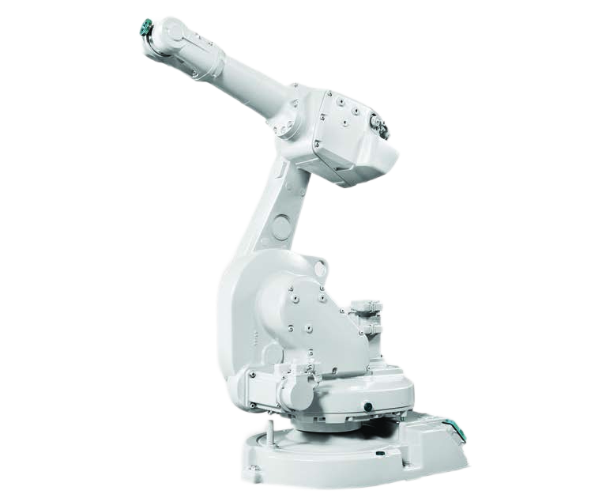
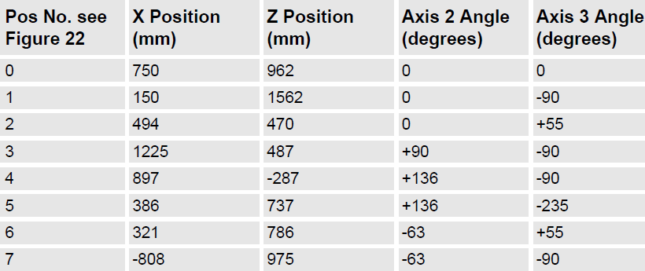

# Robot Simulation with ABB Robot Studio

## Robot System Design (RME40003)

**Abdulswamad Rama Salim (101229220)**

**Bachelor of Robotics and Mechatronics (Honours)**

**Lecturer: Dr Hudyjaya Siswyoyo Jo**

**May 9, 2024**

---

## 1. Introduction

The objective of this assignment is to emulate the functions of a robot using ABB's proprietary simulation software, RobotStudio®. RobotStudio®replicates ABB robots in a virtual setting and includes features like offline programming and access to a free Network License from Campus for up to 90 days, I used the software for this assignment. The primary focus of this assignment is to use the simulation to guide a robotic arm in accurately tracing a model design or symbol within an assigned workspace, ideally on a table.

---

## 2. Choice of Robot

For the purposes of this project, the ABB IRB 1600 was selected. This particular robot model is distinguished by its balance of capabilities, offering ample load capacity and a reach of 1.2 meters. The IRB 1600 is a very versatile robot, hence not limited by the demands of this assignment, as it is required only to operate a pen end effector without the need for additional load support. The image of the ABB IRB 1600 robot is shown below:



**Figure 1: ABB IRB 1600 Robot**

The robot chosen has a payload of 6kg and weights 30.5kg. It has a repeatability of 0.02. The ABB IRB 1600 robot has six axes as depicted below:


**Figure 2: ABB IRB 1600 Manipulator axes**

From its documentation, the ABB robot with a 1.2m reach is shown with its wrists at extreme positions and the corresponding position values.


**Figure 3: Extreme positions of robot arm with 1.2m reach**

After selecting the ABB IRB 1600 for the project, the next step was to design the workspace and define the specific movements required for the robot to accurately trace the designated path of the model placed on the table. This involved using the offline programming feature in RobotStudio®, Auto Path to create a precise path for the robotic arm to follow. Additionally, the simulation software was used to edit and adjust the path to ensure accuracy in achieving the desired result.

To transfer the model from SolidWorks to RobotStudio®software, the following steps were followed:

1.  **Design:** Initially, the "RSD" flag model was designed in SolidWorks.
2.  **Export Process:** The model was then exported from SolidWorks using the 'Save As' feature, where .sat was specified as the desired output format.
3.  **Import Process:** After exporting the model, it was imported into Robot Studio using the 'Import Geometry' feature.
4.  **Model Positioning and Alignment:** Once the "RSD" flag model was imported into RobotStudio as a .sat file, the model was positioned on top of the table model, aligned, and set within the User Coordinate System (UCS). The UCS is our default coordinate system, providing a reference frame for the robot's operations.

Model Positioning and Alignment: Once the "RSD" flag model was imported into Robot- Studio as a sat file, the model was positioned on top of the table model, aligned, and set within the User Coordinate System (UCS). The UCS serves as our default coordinate system, providing a reference frame for the robot's operations.

Once the "RSD" flag model was brought into RobotStudio as a sat file, it was placed over the table model, aligned, and positioned within the User Coordinate System. The UCS acts as our primary coordinate system, offering a framework for the robot's tasks.


**Figure 4: ABB IRB 1600 Robot Simulation on RobotStudio®**

### 2.a. SolidWorks Model

The model is a custom-made flag with the initials ”RSD” representing Robot System Design. The model was created using SolidWorks and the final design was saved as a .sat file format, that is compatible with Robot Studio.


**Figure 5: CAD Model of Flag bearing ’RSD’ initials**

---

## 3. Tracing the Model

For the tracing, the end effector used is ”MyTool,” provided by ABB RobotStudio software. It functionally acts as a pen. Four paths were created at first to correspond with the four figures: the flag itself and the letters R, S, and D. The paths were designed to follow the unique contours of each figure. Some of the letters like R and S had curvy features hence it was necessary to merge linear paths to create a ’MoveC’ command — a circular path motion. This ensured the smoothness and continuity of the tracing, avoiding sharp, mechanical transitions.


**Figure 6: Model with 4 paths on RobotStudio®**

Even though, auto-pathing is a powerful feature in RobotStudio, some paths were created manually to improve the precision and detail in the pen’s movement. After tracing each figure, the pen was programmed to lift off the surface to transition between the separate items. This involved creating new targets and paths and modifying the z-coordinate of to enable the tool to rise after completing one figure and accurately descend to start tracing the next.



**Figure 7: Model depicting final traced path on RobotStudio®**

The four paths created initially were then merged to one path named COMPLETE PATH. The RAPID code for the complete trace was called in the main procedure func- tion. This is so as the program will execute the entire task as a single function call.

```rapid
PROC main()
    COMPLETE_PATH;
    MOVE_HOME;
ENDPROC
```

A wait function was also called at the end of the robot's tracing. The robot paused before restarting the task, it ran in continuous run mode to allow for recording of the simulation.

```rapid
PROC MOVE_HOME()
    MoveL Target_930_4,v600,fine,MyTool\WObj:=Table_Workobject;
    WaitTime 20;
ENDPROC
```

### 3.a. Video Demonstration

To see a video demonstration of the setup, click [here](https://www.youtube.com/watch?v=dQw4w9WgXcQ).

---

## 4. Conclusion

In conclusion, the project successfully achieved simulating robot and tracing the path of the model in ABB's RobotStudio®. The requirements of this task and fulfilled and will be submitted together with the Pack and Go file from Robot Studio which can be opened and the simulation programme accessed from other computers. I have personally gained a lot of understanding of robot programming and simulation from this assignment and I hope to learn more and further apply this knowledge in automation tasks while future working in the industry.
